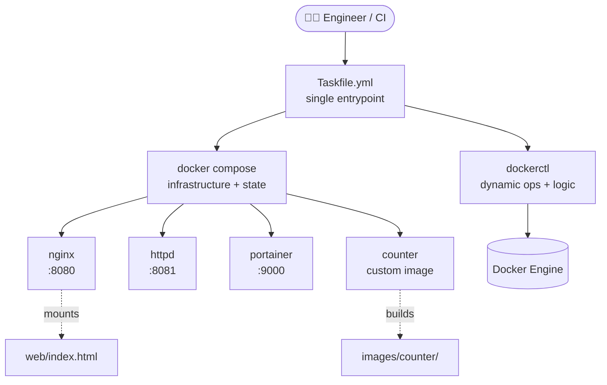

<div align="center">

# 🐳 dockerctl — a hardened Docker operations toolkit

**Typed Python CLI · declarative hardened compose stack · supply-chain-gated CI**

[](https://github.com/www8351/Docker-DevOps-Tooling/actions/workflows/ci.yml)
[](https://github.com/www8351/Docker-DevOps-Tooling/actions/workflows/release.yml)
[](https://github.com/www8351?tab=packages&repo_name=Docker-DevOps-Tooling)


</div>

---

A production-grade Docker toolkit: compose owns state, a typed Python CLI owns dynamic
operations, a Taskfile glues them, and CI enforces everything. Every long-running container
is **read-only, non-root, capability-dropped, and health-checked**.

```console
$ docker compose ps
NAME                  IMAGE                           STATUS                    PORTS
compose-counter-1     compose-counter                 Up 18 seconds (healthy)
compose-httpd-1       httpd:2.4-alpine                Up 18 seconds (healthy)   0.0.0.0:8081->80/tcp
compose-nginx-1       nginx:1.27-alpine               Up 18 seconds (healthy)   0.0.0.0:8080->80/tcp
compose-portainer-1   portainer/portainer-ce:2.27.9   Up 18 seconds             0.0.0.0:9000->9000/tcp
```

## ⚡ Highlights

- **78 MB Ubuntu → ~7 MB hardened Alpine** — the [before/after](#-counter--from-78-mb-of-attack-surface-to-a-few-mb) of the counter image
- **Read-only containers, `cap_drop: ALL`, `no-new-privileges`** — see [`compose/docker-compose.yml`](compose/docker-compose.yml)
- **SHA-pinned actions, Trivy gate, CycloneDX SBOMs** — see [`ci.yml`](.github/workflows/ci.yml)
- **Typed CLI: mypy strict, 45 tests, 100% coverage** — see [`cli/`](cli/)
- **Released [v0.2.0](https://github.com/www8351/Docker-DevOps-Tooling/releases/tag/v0.2.0)** with semver images on GHCR + a [CHANGELOG](CHANGELOG.md)

---

## 💡 Why this exists

This repo began as a set of **interactive bash menus** written years ago to learn Docker.
They worked at a keyboard, but they were fragile and impossible to automate. Everything was
rebuilt as declarative config, a flag-driven CLI, and CI validation on every push.

The result is **non-interactive, reproducible, and pipeline-safe**.

---

## 🏗 Architecture



**Separation of concerns** — each tool owns exactly one job:

| Layer | Owns | Tool |
|-------|------|------|
| 🧱 Infrastructure | container lifecycle, networks, volumes, state | `docker-compose` |
| 🐍 Logic | dynamic image/container ops, error handling | Python + Typer |
| ▶️ Orchestration | day-to-day commands | Taskfile |
| 🤖 Quality gate | validation, no humans | GitHub Actions |

---

## 📂 Project layout

```
.
├── compose/
│   ├── docker-compose.yml   # declarative stack (nginx, httpd, portainer, counter)
│   └── .env.example         # ports + image tags  →  copy to .env
├── images/
│   └── counter/             # custom image, built by compose
│       ├── Dockerfile       # multi-stage, hardened, Alpine, non-root
│       └── counter.sh       # POSIX sh (no bash needed)
├── web/
│   └── index.html           # served by nginx from a read-only mount
├── cli/                     # dockerctl — non-interactive Python CLI
│   ├── Dockerfile           # multi-stage build → slim Alpine, non-root
│   ├── .dockerignore
│   ├── pyproject.toml
│   └── dockerctl/
│       ├── __main__.py      # entrypoint + subcommand wiring
│       ├── _docker.py       # typed wrapper around the docker CLI
│       ├── images.py        # pull / rm
│       └── containers.py    # ls / rm / deploy
├── Taskfile.yml             # engineering entrypoint
└── .github/workflows/ci.yml # lint + validate on every push
```

---

## ✅ Requirements

| Tool | Why | Install |
|------|-----|---------|
| Docker Engine + Compose v2 | run the stack | <https://docs.docker.com/get-docker/> |
| Python ≥ 3.10 | run `dockerctl` | <https://www.python.org/> |
| Task (optional) | task runner | <https://taskfile.dev/installation/> |

> Without Task installed, every command has a raw `docker compose` equivalent shown below.

---

## 🚀 Quick start

```bash
# 1. configure ports / image tags
cp compose/.env.example compose/.env

# 2. start everything in the background
task up                 # or: docker compose -f compose/docker-compose.yml up -d

# 3. open the services
#    nginx     → http://localhost:8080
#    httpd     → http://localhost:8081
#    portainer → http://localhost:9000

# 4. tear down
task down               # or: docker compose -f compose/docker-compose.yml down
```

---

## 🧱 The stack (docker-compose)

Defined in [`compose/docker-compose.yml`](compose/docker-compose.yml). Ports and tags come
from `compose/.env` (never hardcoded); tags are **pinned by default**.

| Service | Image | Default port | Health | Network | Notes |
|---------|-------|--------------|--------|---------|-------|
| `nginx` | `nginx:1.27-alpine` | `8080:80` | `wget` probe | `web` | serves `web/` read-only |
| `httpd` | `httpd:2.4-alpine` | `8081:80` | `wget` probe | `web` | replaces the old non-existent `apache2` |
| `portainer` | `portainer/portainer-ce:2.27.9` | `9000:9000` | — (scratch image) | `mgmt` | Docker UI, replaces dead `dockerui` |
| `counter` | built from `images/counter/` | — | `pgrep` probe | `web` | incrementing counter; hardened Alpine, non-root (see [suite](#-devops-tooling--containerization-suite)) |

Every service runs with a **read-only root filesystem** (tmpfs for known write
paths), **all capabilities dropped** (web servers re-add only what port 80
needs), `no-new-privileges`, CPU/memory limits, and bounded json-file logging.
The `mgmt` network isolates docker.sock consumers from the public-facing tier.
The alpine tags are load-bearing: busybox `wget` powers the healthchecks.

```bash
task build    # docker compose --profile tools build  (counter + dockerctl)
task pull     # docker compose pull
task logs     # docker compose logs -f
task clean    # down + remove volumes
```

---

## 🛡 DevOps Tooling & Containerization Suite

Two purpose-built images, each authored as a **multi-stage build on a minimal Alpine base
and run by an unprivileged user**. The goal is small, reproducible, and low-attack-surface —
the build toolchain never reaches the final image, and neither does root.

| Image | Source | Base | Multi-stage layout | Runs as |
|-------|--------|------|--------------------|---------|
| `counter` | [`images/counter/`](images/counter/) | `alpine:3.20` | `lint` (shellcheck gate) → `runtime` | non-root `app` (UID 10001) |
| `dockerctl` | [`cli/`](cli/) | `python:3.12-alpine` | `builder` (venv via `python:3.12-slim`) → `runtime` | non-root `app` (UID 10001) |

### 🔢 `counter` — from 78 MB of attack surface to a few MB

The original image ran a trivial bash loop on `ubuntu:24.04` while installing
`openssh-server`, `sshpass`, `tcpdump`, `net-tools`, and `python3` — **none of which the
script uses**. `sshpass` and `tcpdump` alone are exactly what an image scanner flags first.

| | Before ❌ | After ✅ |
|--|----------|---------|
| Base | `ubuntu:24.04` (~78 MB) | `alpine:3.20` (~7 MB) |
| Extra packages | ssh, sshpass, tcpdump, net-tools, python3 | none |
| User | root | non-root `app` (UID/GID 10001) |
| Stages | 1 | 2 (lint gate → runtime) |
| Script | bash + dead `/var/log/my` symlinks | POSIX `sh`, no bash needed |

**Hardening choices**
- **Build-time lint gate** — stage 1 runs `shellcheck` against `counter.sh`; a broken script
  fails `docker build`, so bad shell never reaches an image.
- **Carry only what runs** — the runtime stage copies *just* the validated script; every package
  from the old image is gone.
- **Non-root by construction** — a fixed-ID `app` user owns nothing it doesn't need; the script
  is installed read-and-execute only (`0555`).
- **POSIX `sh`** — rewriting the one bashism (`((counter++))` → `$((counter + 1))`) lets it run on
  Alpine's busybox `ash`, so no `bash` package is installed at all.

### 🐍 `dockerctl` — multi-stage Python, no toolchain in the runtime

```bash
docker compose --profile tools build dockerctl      # or: docker build -t dockerctl cli

docker run --rm dockerctl version                   # → 0.1.0  (no socket needed)
docker run --rm dockerctl images --help

# drive the real engine by mounting the host socket:
docker run --rm -v /var/run/docker.sock:/var/run/docker.sock \
  dockerctl images pull nginx:latest
```

**Hardening choices**
- **Builder/runtime split** — the `builder` stage uses a full `python:3.12-slim` to install the
  project into an isolated venv at `/opt/venv`; the runtime stage copies only that venv, so pip,
  build tools, and caches never ship.
- **Minimal runtime** — `python:3.12-alpine` plus only `docker-cli` (the client, not a daemon),
  because `dockerctl` shells out to `docker` (see [`cli/dockerctl/_docker.py`](cli/dockerctl/_docker.py)).
- **Non-root `app` user** and a lean build context via [`cli/.dockerignore`](cli/.dockerignore)
  (tests, caches, and the Dockerfile itself are excluded).
- **No socket baked in** — the engine is reached only through an explicitly mounted
  `/var/run/docker.sock` at run time, so the image grants itself nothing.

### 🔎 Scanned in CI

Both images are built and scanned by **Trivy** on every push (see
[CI](#-continuous-integration)). The scan **gates on HIGH/CRITICAL** findings
(`ignore-unfixed: true`, so unpatchable upstream base CVEs don't break the build).

---

## 🐍 The CLI (dockerctl)

A small **non-interactive** CLI for the dynamic operations compose shouldn't own
(ad-hoc pulls, removals, one-off deploys). Flags only — no prompts — so it is safe in CI.
Every command returns a meaningful **exit code** and writes errors to stderr.

```bash
pip install -e cli            # installs the `dockerctl` command
```

```bash
dockerctl containers deploy nginx:latest -n web -p 8080:80
dockerctl containers stats --json
dockerctl images push ghcr.io/acme/counter:1.0
dockerctl --version           # or -V, or the `version` subcommand
```

<details>
<summary><b>Full command reference</b> (2 groups, 14 commands)</summary>

| Command | Replaces | Example |
|---------|----------|---------|
| `images ls [--json]` | menu listing | `dockerctl images ls --json` |
| `images build <path> -t <tag>` | build menus | `dockerctl images build images/counter -t counter:dev` |
| `images pull <ref>` | `pull_images.sh` | `dockerctl images pull nginx:latest` |
| `images rm <id> [-f]` | `remove_images.sh` | `dockerctl images rm nginx:latest` |
| `images tag <src> <target>` | — | `dockerctl images tag counter:dev ghcr.io/acme/counter:1.0` |
| `images push <ref>` | — | `dockerctl images push ghcr.io/acme/counter:1.0` |
| `containers ls [-a] [--json]` | menu listing | `dockerctl containers ls --all` |
| `containers rm <id> [-f]` | `remove_Container.sh` | `dockerctl containers rm web --force` |
| `containers deploy ` | deploy menus | `dockerctl containers deploy nginx:latest -n web -p 8080:80` |
| `containers logs / stop / start / restart` | menu ops | `dockerctl containers restart -t 5 web` |
| `containers exec / inspect / stats` | menu ops | `dockerctl containers stats --json` |

`dockerctl --help` prints the full command tree; each group has its own `--help`.

</details>

The CLI is **mypy-strict clean** and its test suite is **coverage-gated at
90%** (currently 100%); the version is single-sourced from `pyproject.toml`.

---

## ▶️ Task runner

[`Taskfile.yml`](Taskfile.yml) is the one entrypoint everyone (and CI) uses.

```bash
task            # list all tasks
task up         # start the stack
task down       # stop + remove
task build      # build images
task pull       # pull images
task logs       # tail logs
task clean      # down + volumes
task lint       # run every linter locally
task cli -- images pull nginx:latest   # proxy to dockerctl
```

---

## 🤖 Continuous integration

[`.github/workflows/ci.yml`](.github/workflows/ci.yml) runs on every push and pull request —
**fully unattended, nothing prompts** — under least-privilege permissions with
every action **pinned to a commit SHA** and per-ref concurrency:

**`lint` job**
1. ✅ **Compose** — `docker compose config` validates the stack
2. 🐳 **Dockerfiles** — `hadolint` lints both `images/counter/Dockerfile` and `cli/Dockerfile`
3. 🐚 **Shell** — `shellcheck` on shell scripts
4. 🐍 **Python** — `ruff` lint + format check
5. 🔍 **Types** — `mypy` in strict mode
6. 📦 **Tests** — `pytest` with a 90% coverage gate

**`image` job** (matrix: counter, dockerctl)
- builds via buildx with GitHub Actions **layer caching**
- scans with **Trivy** (gates HIGH/CRITICAL, `ignore-unfixed`)
- generates a **CycloneDX SBOM** per image, uploaded as an artifact

**`publish` job** (pushes to `main` only)
- pushes both images to **GHCR** tagged `latest` + short commit SHA

[Dependabot](.github/dependabot.yml) keeps GitHub Actions, pip, and both
Dockerfiles updated weekly.

---

## 🚢 Releases & published images

Tagging `vX.Y.Z` (matching `cli/pyproject.toml` — the workflow asserts it)
fires [`release.yml`](.github/workflows/release.yml): semver-tagged images on
GHCR plus an auto-generated GitHub Release. Curated notes live in
[CHANGELOG.md](CHANGELOG.md).

```bash
docker pull ghcr.io/www8351/docker-devops-tooling/dockerctl:0.2.0
docker pull ghcr.io/www8351/docker-devops-tooling/counter:0.2.0
```

---

## 🎯 Design principles

- **Declarative over imperative** — compose describes the desired state; we don't script `docker run`.
- **No interactivity** — flags and env vars only, so everything works in a pipeline.
- **Meaningful exit codes** — failures fail loudly and stop CI.
- **One entrypoint** — Taskfile, so nobody memorizes long commands.
- **Right tool per job** — compose for infra, Python for logic, Task to glue, CI to enforce.

---

## 🧰 Troubleshooting

<details>
<summary><b>Common issues and fixes</b></summary>

| Symptom | Fix |
|---------|-----|
| `task: command not found` | Install Task, or use the `docker compose …` equivalents above. |
| Port already in use | Change the port in `compose/.env` and re-run `task up`. |
| Page looks unstyled | Hard-refresh; `web/index.html` is mounted live (no rebuild needed). |
| `dockerctl: command not found` | Run `pip install -e cli` first. |
| Permission denied on docker socket | Add your user to the `docker` group, or run with `sudo`. |
| A service is unhealthy / crash-looping | Check `docker compose ps` + `task logs`; the stack runs read-only — see the tmpfs lists in the compose file. |

</details>

---

## 🤝 Contributing / Security / Changelog

- [CONTRIBUTING.md](CONTRIBUTING.md) — setup, quality gates, conventions, release steps
- [SECURITY.md](SECURITY.md) — reporting vulnerabilities, security posture
- [CHANGELOG.md](CHANGELOG.md) — curated, Keep-a-Changelog format

---

<div align="center">
<sub>From interactive bash menus to a supply-chain-gated toolkit — the <a href="CHANGELOG.md">CHANGELOG</a> tells the story.</sub>
</div>
